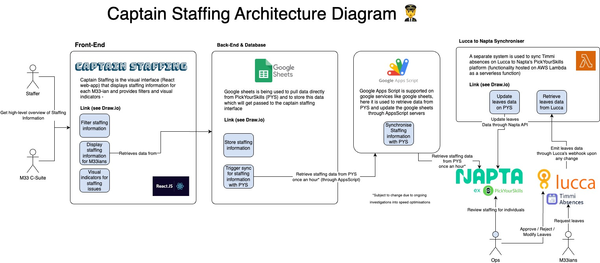

# Captain Staffing

[https://captain-staffing.m33.tech](https://captain-staffing.m33.tech)

Captain Staffing is a staffing management tool to keep track of projects and holidays across all staff members by presenting data from Napta in a more readable format. Built on React with Javascript, and deployed to GitHub Pages.

More details on development and main functionality can be found in the [Onboarding Notes](https://www.notion.so/m33/Onboarding-Notes-Captain-Staffing-8b28e8b80a274fb6a1928f487cb9e379)

## Requirements

- Node v16.17.0
- To view staffing data, view access is required for the [GlobalStaffingReport](https://docs.google.com/spreadsheets/d/1tSvNVwSP080fkQwG7drmQ4c2lPYNWUMZ1_STaWQXXsM/edit#gid=32245808) spreadsheet (or the [staging](https://docs.google.com/spreadsheets/d/1L7BDXbzl-wjxjXQC2nzPr_Y5f0yRUchhRWD0SbIcex4/edit#gid=0) sheet).
  - Edit permissions are required to use the Update Staffing button
  - Please contact Ambroise/Simon to be added.

## Installation

```
yarn install
```

## Develop Locally

```
yarn dev
```

## Build

```
yarn build
```

## Deploy

Vercel triggers a deploy automatically when you upadte the master branch (e.g. when you merge your PR)

## [Architecture Diagram](https://app.diagrams.net/#G1e2bzPIZCX5jeMCaOFt4A8heRurJYnbYe)


